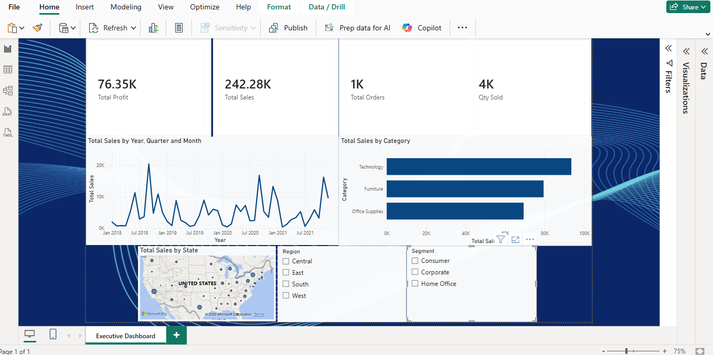

# 📊 Power BI Executive Sales Dashboard

An end-to-end Power BI project: data cleaning in Power Query, DAX modeling, and an interactive Executive Dashboard built on a retail sales dataset.

## 📁 Project Overview

The dataset comes from the DigiSkills DBI101 (Data Analytics and Business Intelligence) course. It was first prepared in Excel (product data combined from two sheets using XLOOKUP), then cleaned and modeled in Power BI, and finally presented as an Executive Dashboard.



## 🧹 Data Cleaning (Power Query)

- Removed blank rows (Remove Blank Rows)
- Removed duplicate rows (Remove Duplicates)
- Standardized `Customer Name` using Capitalize Each Word (e.g., "mike williams" → "Mike Williams")
- Merged `Day`, `Month` and `Year` columns (hyphen separator) into a single `Order Date` column
- Split the combined `Country-State-City` column by delimiter into `Country`, `State` and `City`

## 🧮 Data Modeling (DAX)

**Calculated Columns**
```
Sales Category    = IF([Sales] > 100, "High", "Low")
Discount Category = IF([Discount] = 0, "No Discount", "Discount Applied")
```

**Measures**
```
Total Sales  = SUM(Sales[Sales])
Qty Sold     = SUM(Sales[Quantity])
Total Orders = COUNT(Sales[Product Name])              -- counts order rows (line items)
Total Profit = SUMX(Sales, Sales[Quantity] * Sales[Profit])   -- iterator function (Quantity x Profit, as per the exercise brief), as specified in the course brief (Quantity × Profit)
```

The measures were validated with a Matrix visual (grouped by Category, with a Grand Total row).

## 📈 Executive Dashboard

- **KPI Cards:** Total Profit, Total Sales, Total Orders, Qty Sold
- **Sales Trend:** Total Sales over the Order Date hierarchy (Year > Quarter > Month > Day)
- **Category Analysis:** Total Sales by Category (bar chart, sorted high to low)
- **Geo Analysis:** Total Sales by State (map, bubble size = sales)
- **Slicers:** Region and Segment for interactive filtering
- Custom theme and background applied

## 🛠️ Tools Used

- Microsoft Power BI Desktop (Power Query, DAX)
- Microsoft Excel (initial data preparation with XLOOKUP)

## 📌 Note

Built as hands-on practice during the DigiSkills DBI101 course. The dataset is provided by the course for learning purposes.

---

**Author:** Tayyaba Waheed
🔗 [LinkedIn](https://linkedin.com/in/tayyaba-waheed-413421359) · 🔗 [GitHub](https://github.com/tayyabawaheed504)
